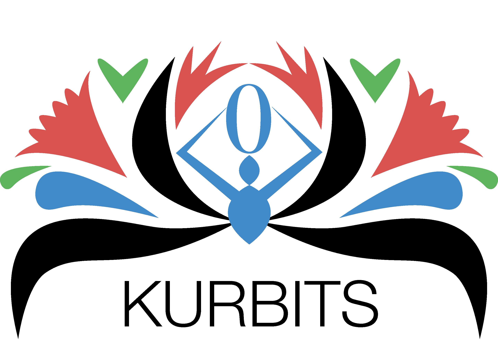

# Kurbits — Documentation

Kurbits is an archival information and collection management system for archives, special collections, and museums. It helps you describe, organise, locate, and track your holdings.

{ style="width:50%" }

## Key concepts

**Resources** are the archival units you describe — fonds, series, files, items, objects. They are arranged in a hierarchy and described using ISAD(G)-aligned fields.

**Agents** are the people, organisations, and families that created, owned, or are otherwise associated with your holdings. They correspond to authority records.

**Locations** are the physical places where objects are stored — buildings, rooms, shelves, cabinets. The location system tracks where things are and where they have been.

**Classifications** are controlled vocabulary schemes used to categorise resources — subject schemes, record types, administrative structures.

**Flags** are internal workflow markers for resources that need attention — metadata issues, conservation concerns, rights questions.

**Acquisitions** covers the intake workflow: submission agreements with depositors, deliveries of material, and the accessions that result.

## Change logs

### [V 1.1 (2026-09-03)](change_logs/1_1.md)

