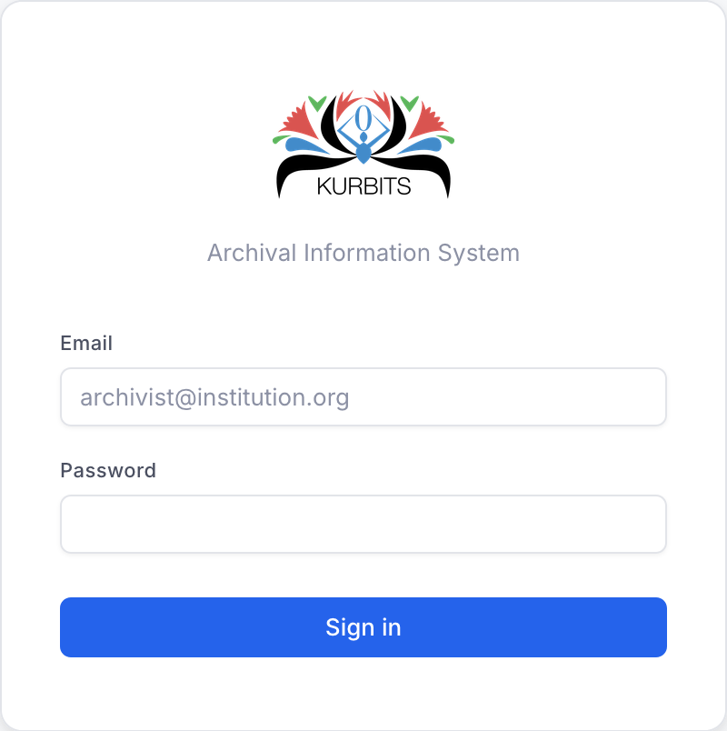
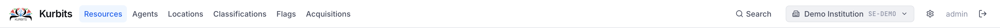
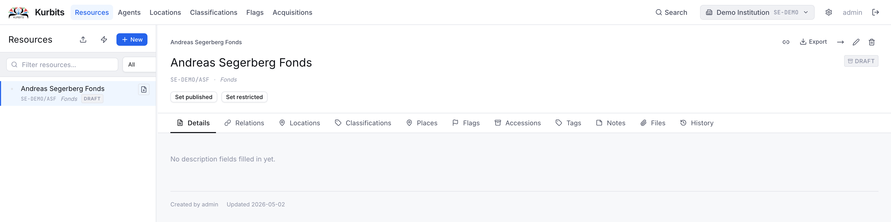

# Getting started

## Logging in

Navigate to your institution's Kurbits URL and enter your email address and password. Kurbits uses session-based authentication — you will remain logged in until you log out or the session expires.

{ style="width:50%" }
## The navigation bar

After logging in you will see the top navigation bar with the main sections of the system.

| Section | Purpose |
|---|---|
| Resources | Describe and browse your archival holdings |
| Agents | Manage authority records for people, organisations, families |
| Locations | Track where physical objects are stored |
| Location overview | See where everything is at a glance |
| Classifications | Manage subject and record type schemes |
| Flags | Review items that need attention |
| Acquisitions | Manage agreements, deliveries, and accessions |

## General layout

Most pages follow the same two-panel layout: a **tree or list** on the left for navigation, and a **detail panel** on the right showing the selected record.

Within the detail panel, information is organised into **tabs** — for example Details, Relations, Notes, Files. Click a tab label to switch between them.

## Saving changes

Most forms save with a dedicated **Save** button. The system does not auto-save. Unsaved changes will be lost if you navigate away.

## Your institution

Kurbits supports multiple institutions. If you belong to more than one, a selector will appear allowing you to switch context. All records are scoped to your active institution.
