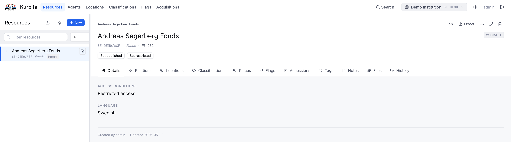
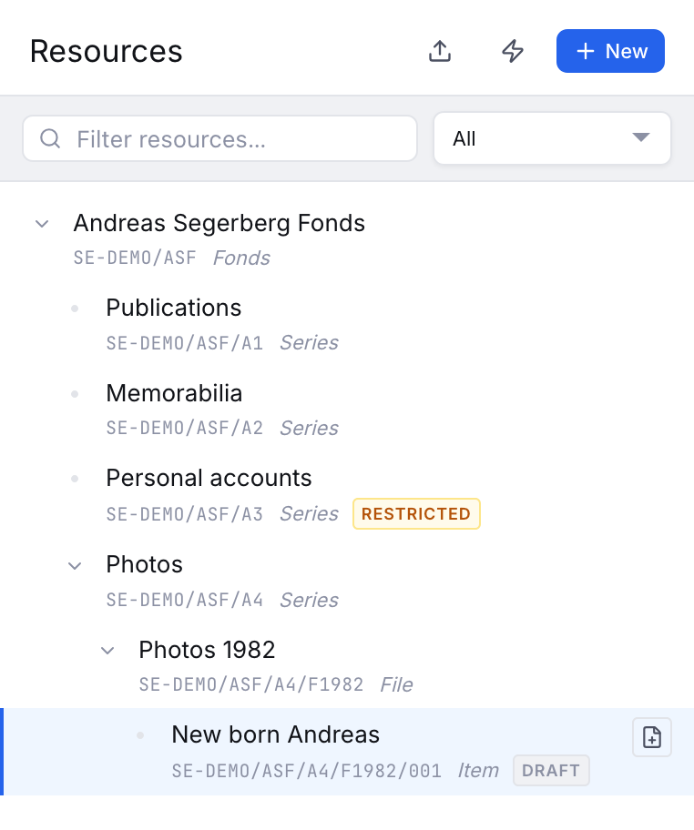
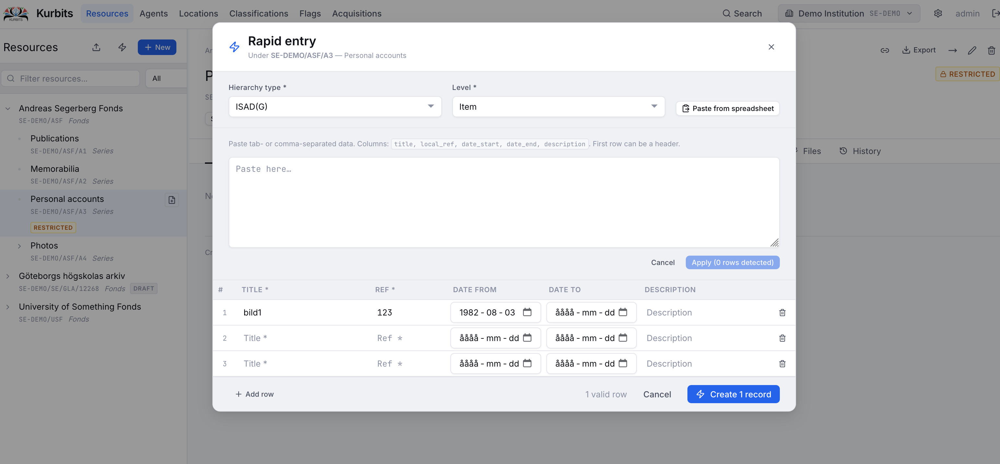
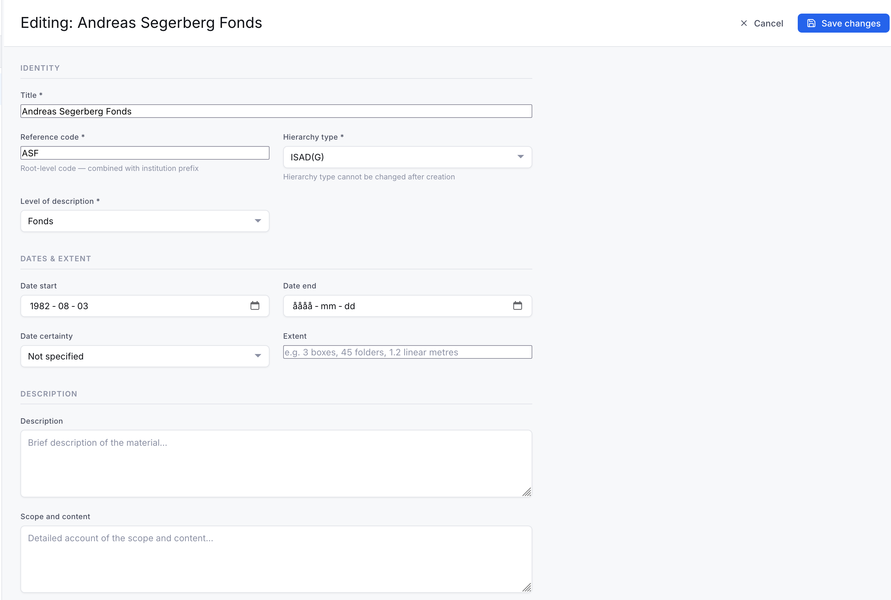
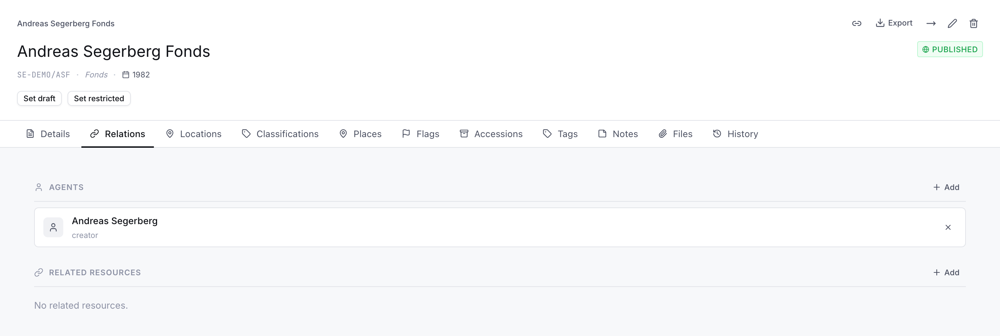
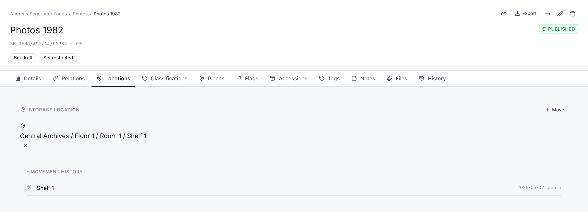
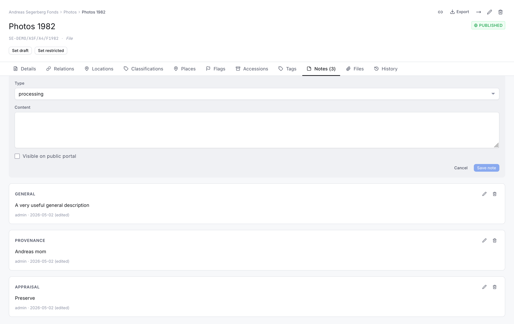
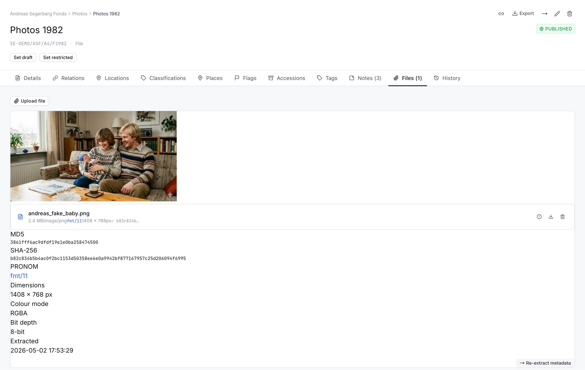

# Resources

Resources are the archival units you describe. A resource can be a fonds, sub-fonds, series, sub-series, file, item, or any level defined by your institution's hierarchy. Resources are arranged in a tree that reflects your archival arrangement.

## Browsing the tree

The left panel shows your archival hierarchy as a collapsible tree. Click an arrow to expand a node and reveal its children. Click a node name to select it and view its details in the right panel.

The tree can be filtered by **hierarchy type** (e.g. ISAD(G), Library) using the dropdown above it. You can also search by typing in the search box — results are shown as a flat list rather than a tree.

{ style="width:50%" }

## Adding resources

Use the **+ New** button at the top of the tree panel to add a root-level node. To add a child node, select a parent node first and then use the **+ Add child** button.

Every new resource requires at minimum a **title** and a **level of description**.

### Rapid Entry 

Kurbits offers a rapid entry functionality. Useful for mass registration of items or boxes. It's also possible to copy and paste directly from a spreadsheet and then populate columns. 

## The Details tab

The Details tab shows the core descriptive fields for the selected resource.

| Field | Description |
|---|---|
| Title | The name of the archival unit |
| Level of description | The level in the hierarchy (Fonds, Series, File, Item…) |
| Reference code | Auto-generated from the institution prefix and the local ref |
| Date(s) | Date range of the material |
| Extent | Physical or digital extent |
| Scope and content | Summary of what the unit contains |
| Description | Additional descriptive text |
| Access conditions | Any restrictions on access |
| Appraisal | Appraisal and disposal decisions |
| Accruals | Expected future additions |

Additional fields may appear depending on the metadata template assigned to the level — for example a photograph record will show fields for format, technique, and dimensions.

## The Relations tab

The Relations tab manages links between this resource and **agents** (creators, contributors, subjects) and links to other resources.

To link an agent, use the search box to find them by name and select the relationship type (Creator, Publisher, Subject, etc.). To link another resource, search by title or reference code.

## The Locations tab

The Locations tab shows where this object is physically located, and allows you to check it in, move it, or check it out.

- **Current location** is shown at the top with its full path (e.g. *Building A / Store 2 / Cabinet 4*).
- The **Check in / Move** button opens a location search to place or relocate the object. An object can only be in one location at a time — checking in automatically removes it from its previous location.
- The **✕** button checks the object out, moving it to the virtual *Checked out* location.
- **Movement history** (expandable at the bottom) shows the complete location history with dates and users.

## The Classifications tab

Links this resource to one or more classification nodes — subject headings, record types, administrative units, or any scheme defined for your institution.

## The Places tab

Links this resource to geographic places — countries, cities, parishes, specific sites. Places can be looked up from Wikidata to auto-fill coordinates and descriptions.

## The Flags tab

Shows any open workflow flags on this resource, such as metadata issues, conservation needs, or rights questions. See [Flags](06-flags.md) for details.

## The Accessions tab

Links this resource to accession records in the Acquisitions module. Clicking an accession reference navigates to that accession. See [Acquisitions](07-acquisitions.md) for details.

## The Tags tab

Assigns subject tags from your institution's tag vocabulary. Tags differ from classifications in that they are lighter-weight labels rather than structured scheme nodes.

## The Notes tab

Free-text notes on this resource. Each note has a **type** (General, Administrative history, Biographical history, Scope and content, Appraisal, Accruals, etc.) and can be marked public or internal.

## The Files tab

Attachments associated with this resource — finding aids, digitised images, transcripts, spreadsheets, or any other file.

When a file is uploaded, Kurbits automatically extracts technical metadata:

- **Checksums** (MD5 and SHA-256) for fixity verification
- **MIME type** identified from file content (not just extension)
- **PRONOM format ID** linked to the National Archives format registry
- **Image dimensions, resolution, colour mode, bit depth**
- **EXIF and IPTC metadata** (camera, date, GPS, copyright, keywords)
- **Audio/video duration, codec, bitrate**
- **Thumbnail** for images and PDFs (click to view full file)

Click the **ⓘ** button on any file to expand its technical metadata panel. The **Re-extract metadata** button re-runs extraction on an existing file, useful after a migration.

## The History tab

A full audit log of all changes to this resource — who changed what and when.
