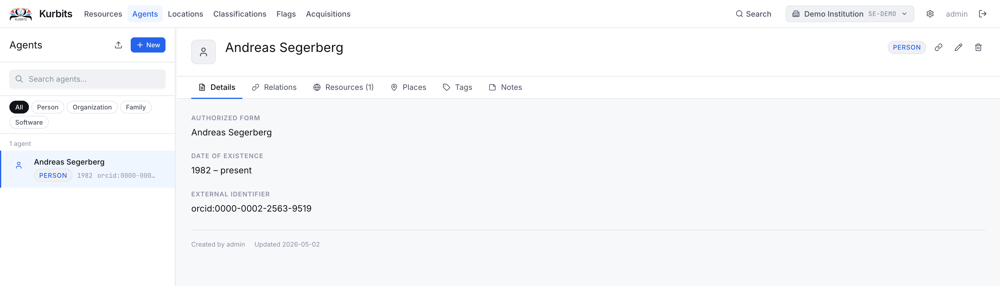
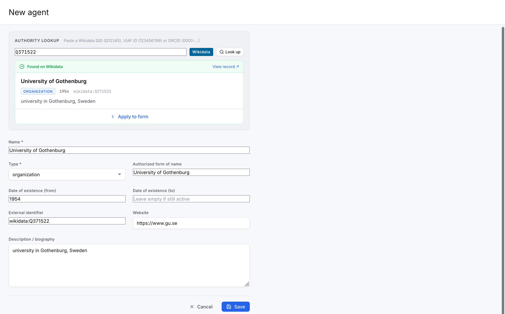
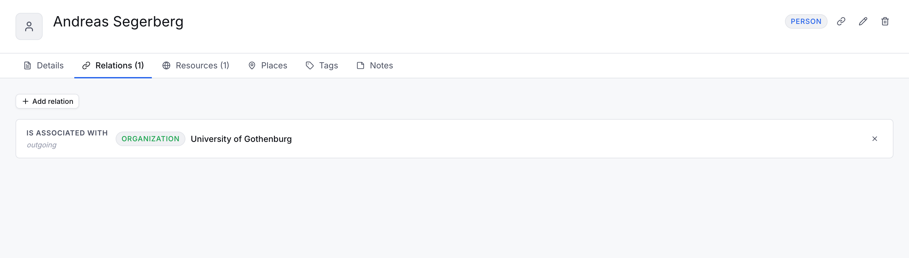
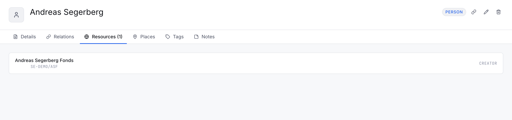
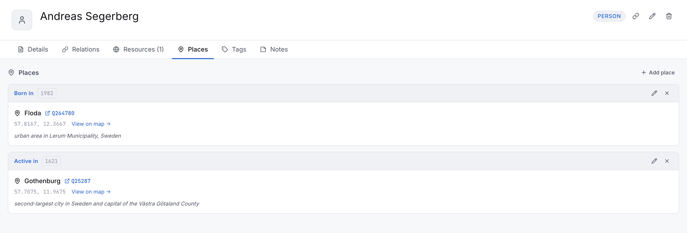
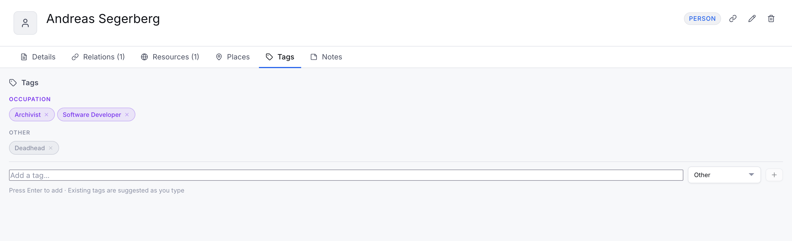

# Agents

Agents are the people, organisations, and families associated with your holdings. They serve as authority records — a single agent record can be linked to many resources.

## Agent types

| Type | Use |
|---|---|
| Person | An individual (archivist, creator, donor, photographer…) |
| Organisation | A corporate body, institution, association, company |
| Family | A family unit as a collective creator or owner |

## Browsing and searching

The left panel lists all agents with a search box at the top. Type to filter by name. Click an agent to view their details.

## Creating an agent

Click **+ New agent** and choose the type. The **authorised form of name** is required — this is the standardised name used for display and linking (following ISAAR(CPF) conventions).

You can paste a Wikidata QID, ORCID or VIAF ID to populate the fields. 

## The Details tab

| Field | Description |
|---|---|
| Authorised form of name | The standardised name (required) |
| Parallel forms of name | Alternative name forms in other languages or scripts |
| Other name forms | Variant names, former names, pseudonyms |
| Agent type | Person, Organisation, or Family |
| Dates of existence | Lifespan or period of activity |
| Description / Biography | Biographical or administrative history |
| ISNI / VIAF / Wikidata | External authority identifiers |

## The Relations tab

Links this agent to other agents — for example a person to the organisation they belong to, or a family to its members. Each relation has a direction and a type (member of, predecessor of, controlled by, etc.).

## The Resources tab

Lists all resources this agent is linked to, with the relationship type (Creator, Publisher, Subject…). Clicking a resource navigates to it.

## The Places tab

Geographic places associated with this agent — birthplace, headquarters, area of activity. Places can be searched and linked from Wikidata, which fills in coordinates, dates, and descriptions automatically.

## The Tags tab
Subject tags assigned to this agent from your institution's tag vocabulary.

## The Notes tab
Internal and public notes on this agent. Note types follow ISAAR(CPF) categories: Biographical history, Organisational history, Legal status, Functions, Mandates, Internal structures, General context.
