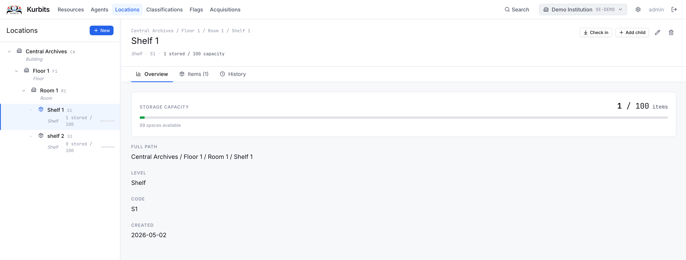
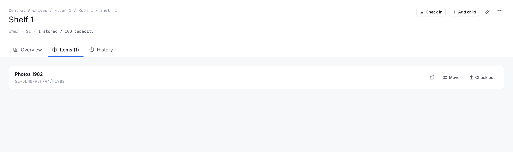
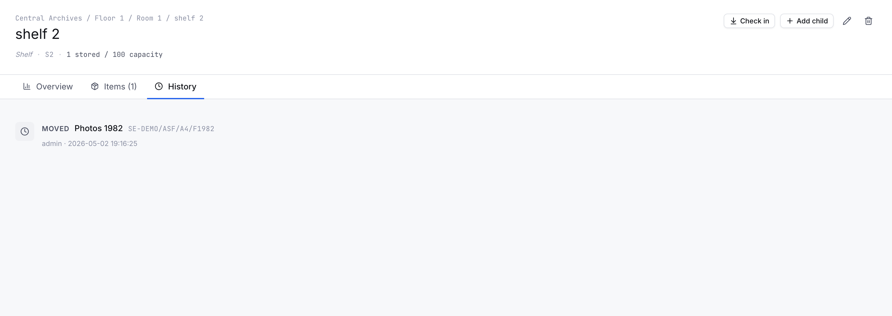
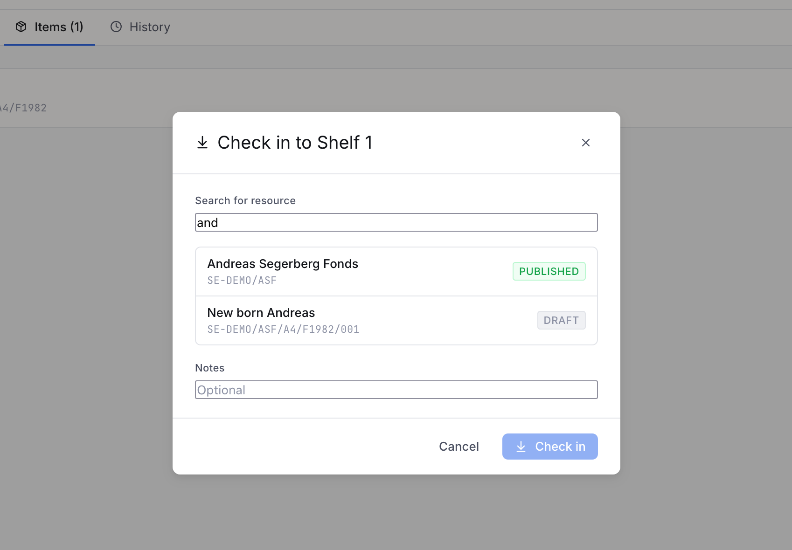
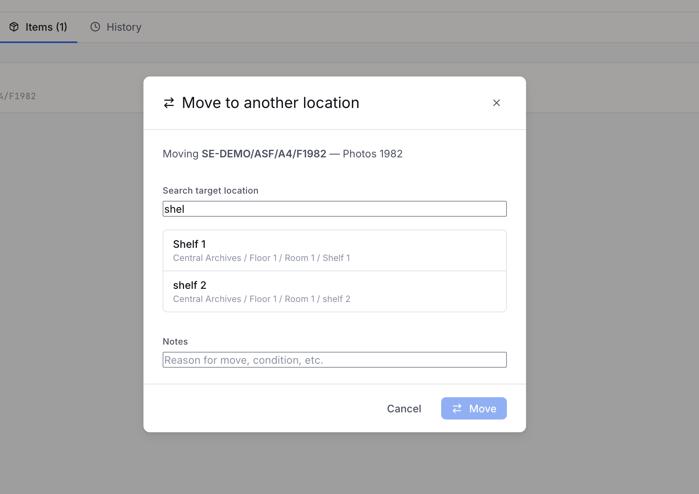

# Locations

The Locations section manages the physical storage places in your institution and tracks where objects are at any given time. Locations are arranged in a hierarchy that mirrors your physical layout.


## Location hierarchy

Locations form a tree — for example:

```
Main Building
  ├── Store Room A
  │     ├── Shelf 1
  │     └── Shelf 2
  └── Gallery 1
        └── Case 3
```

Each location has a **type** that describes what kind of place it is: Building, Room, Gallery, Storage, Cabinet, Shelf, Case, or Drawer. Types affect icons and filtering but not functionality.

**Storable locations** are locations that can hold objects directly — typically shelves, cases, drawers, or cabinets. Higher-level locations (buildings, rooms) are containers for navigating the hierarchy but do not hold objects themselves.

## Creating locations

Select a parent location in the tree and click **+ Add child**. To create a top-level location, use **+ New location**. Every location requires a name. Setting **Can store objects** makes it available when checking in resources.

## The Overview tab

Shows a summary of this location — its type, capacity (if set), number of objects currently stored, and basic details.



## The Items tab

Lists all resources currently stored at this location.



Each row shows the resource's reference code and title. From here you can:

- **↗** — Open the resource directly
- **Move** — Move the object to a different location (opens a location search)
- **Check out** — Remove the object from this location and place it in the virtual *Checked out* location

> The *Checked out* location is a system-managed virtual location. Objects checked out appear there until they are checked back in to a real location. You cannot check out an object that is already checked out.

## The History tab

A movement log for this location — every object that has come in or out, with dates and users.


## Checking in an object

To check an object into a location, first navigate to that location and click **Check in**. Search for the resource by title or reference code and confirm. The object is automatically removed from its previous location — an object can only be in one place at a time.

Alternatively, use the **Locations tab** on the resource itself — see [Resources → Locations tab](02-resources.md#the-locations-tab).

## Moving an object

From the Items tab, click **Move** on any stored object. A search panel opens — type to find the target location and confirm. Movement is recorded in the history with the from- and to-location.


