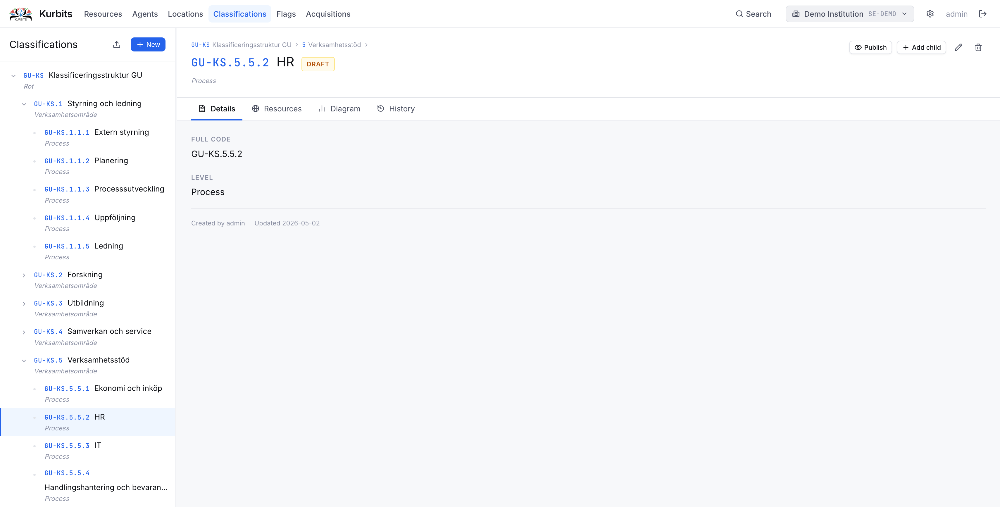
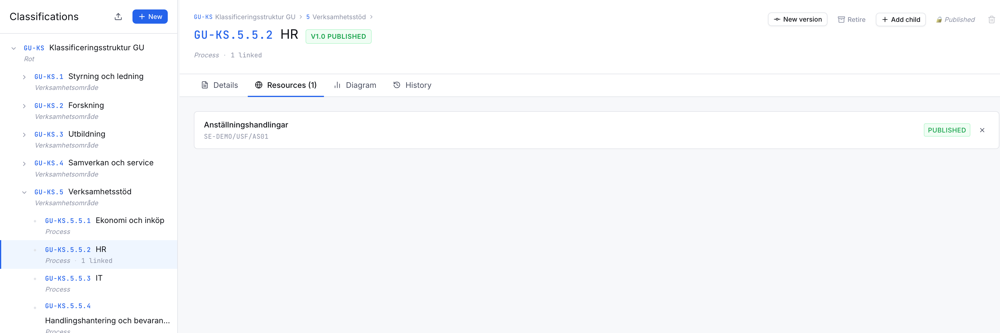
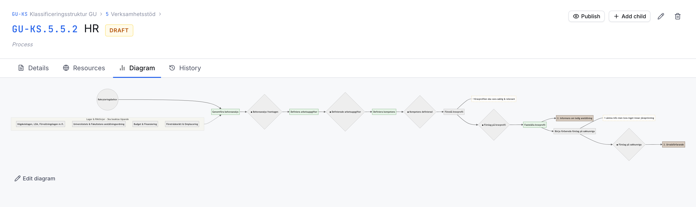
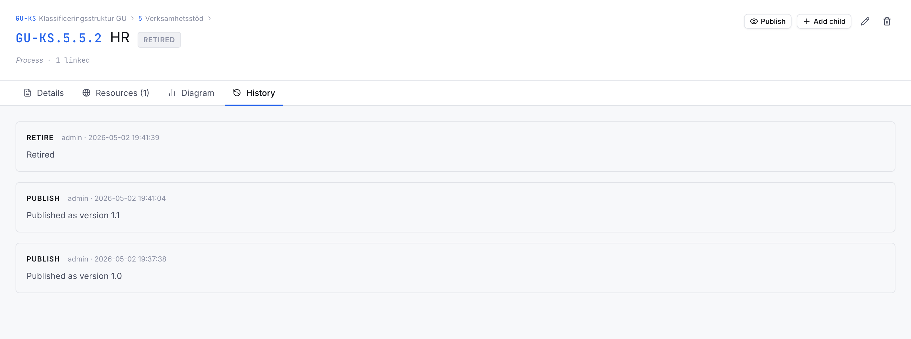
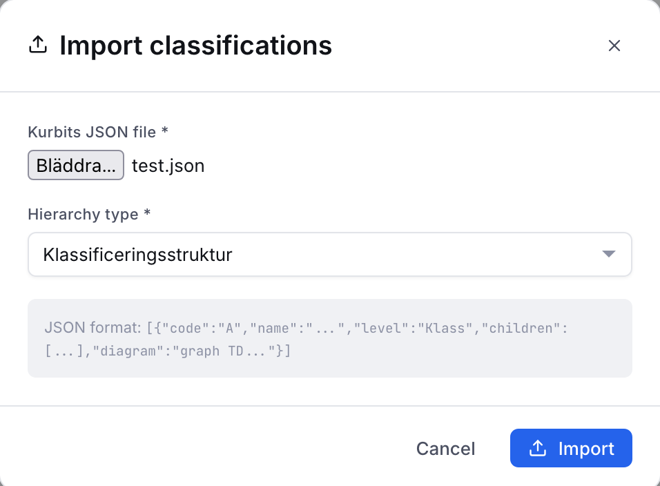
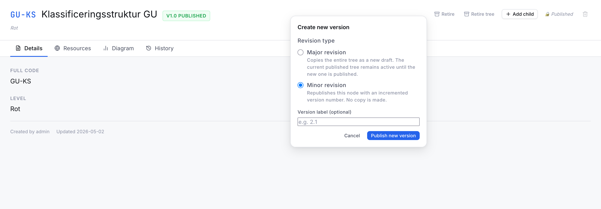

# Classifications

Classifications are controlled vocabulary schemes used to categorise and group resources. A classification scheme might be a subject thesaurus, a record type list, an administrative structure, a functional scheme, or any other controlled list relevant to your institution.

## Schemes and nodes

A **scheme** is a named vocabulary (e.g. *Subject headings*, *Record types*, *Administrative units*). Each scheme contains **nodes** arranged in a hierarchy — nodes can have parent nodes and child nodes.

Resources are linked to individual nodes within a scheme, not to the scheme itself.

## Browsing

The left panel shows all schemes as expandable trees. Click a node to view its details. Use the search box to find nodes across all schemes.

## Creating a scheme

Click **+ New scheme** to create a new classification scheme. Give it a name and an optional description.

## Adding nodes

Select a node in the tree (or the scheme root) and click **+ Add child**. Each node requires a name. Nodes can have a local code, a broader/narrower scope note, and an external URI (for linked data alignment).

## The Details tab

Shows the node's name, code, scope note, and any external identifiers. The **Resources** count shows how many resources are linked to this node.

## The Resources tab

Lists all resources linked to this node. Clicking a resource opens it directly.

## The Process tab

Classification nodes can carry a **BPMN process diagram** that documents the business process behind the records — useful for process-based archival description (*verksamhetsbaserad arkivredovisning*). See [Process descriptions](11-process-descriptions.md) for the full guide.

In short: the Process tab lets you draw the activities, decisions, and records of a process using standard BPMN 2.0 notation, link the records produced to a records classification, and record retention and other records-management metadata on each one.

## The History tab

A version history of this node — all edits with timestamps and users. Previous versions can be previewed and restored.

## Linking resources to classifications

From any resource, go to the **Classifications tab** and use the search to find and link nodes. A resource can be linked to nodes across multiple schemes.

## Importing a classification scheme

Use the **Import** button on the Classifications page to load a scheme from a structured file. Contact your system administrator for supported formats.

## Versioning

Versioning is possible on all levels both minor,major and retirement of a node (which will no longer be avaible for use)
