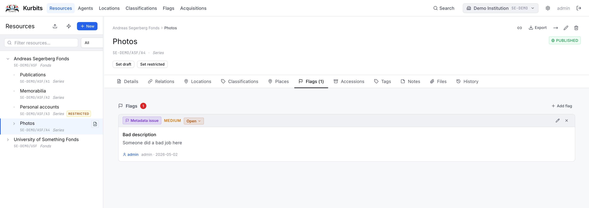
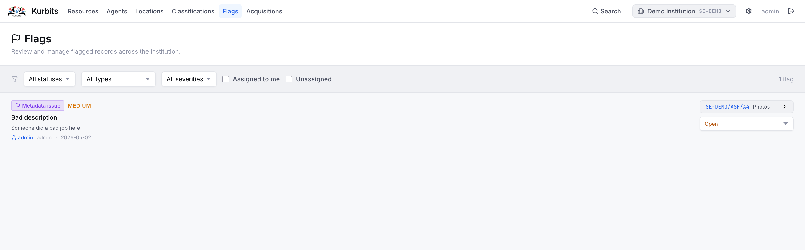

# Flags

Flags are internal workflow markers placed on resources that require attention. A flag might indicate a metadata problem, a conservation issue, an unresolved rights question, or anything else that needs to be acted on.

Flags are visible both on the individual resource and on the institution-wide **Flags page**.

## Flag types

| Type | Use |
|---|---|
| Metadata | Missing, incorrect, or incomplete descriptive information |
| Conservation | Physical condition concerns |
| Digitisation | Queued for or blocked from digitisation |
| Rights | Copyright, licensing, or access restriction questions |
| Access | Access control issues |
| Duplicate | Suspected or confirmed duplicate record |
| Other | Any other issue |

## Severity levels

Each flag has a severity: **Low**, **Medium**, or **High**. Use severity to indicate urgency and to prioritise work.

## Flag status

| Status | Meaning |
|---|---|
| Open | Issue identified, not yet being worked on |
| In progress | Actively being addressed |
| Resolved | Issue closed |

## Adding a flag to a resource

Open the resource and go to the **Flags tab**. Click **+ Add flag**, choose a type and severity, write a description of the issue, and optionally assign it to a colleague.

## The Flags page

The Flags page gives an institution-wide view of all open flags.

Use the filter buttons to show:
- **All** open flags
- **Assigned to me** — flags assigned to your user account
- **Unassigned** — flags not yet assigned to anyone

Click any flag row to navigate to the resource it belongs to.

## Resolving a flag

Open the flag (either from the resource's Flags tab or from the Flags page), change the status to **Resolved**, and save. Resolved flags are hidden from the default view but remain in the record.
