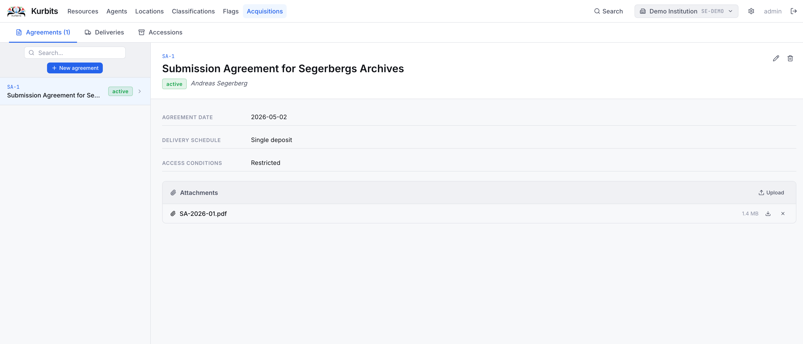
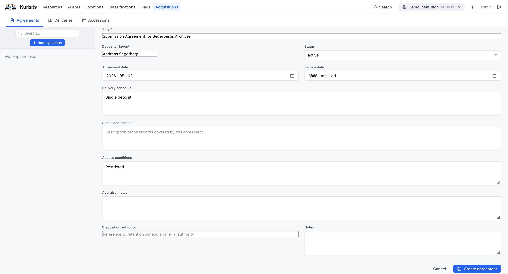
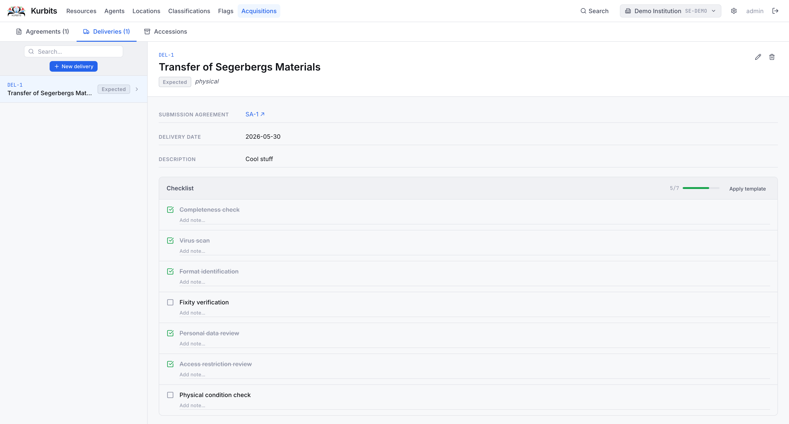
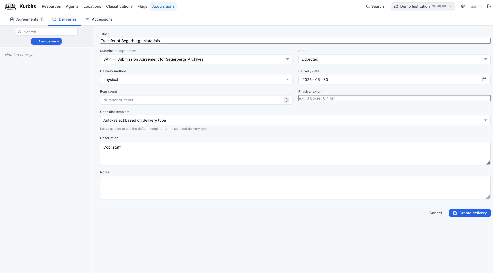
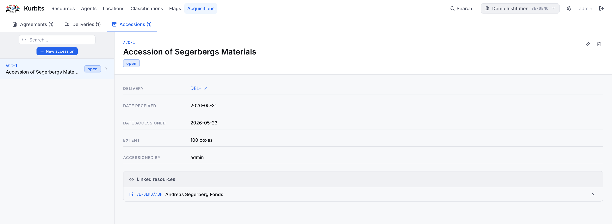
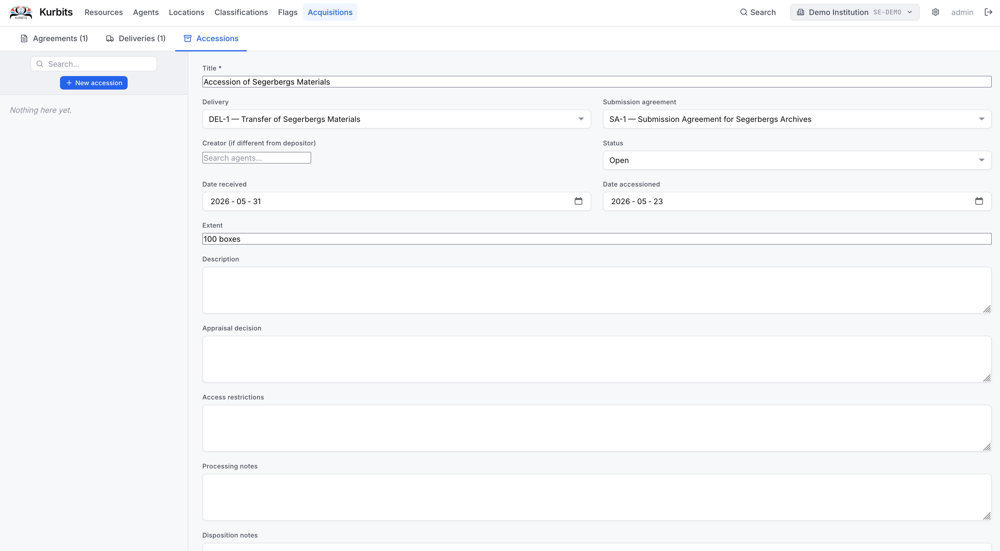

# Acquisitions

The Acquisitions module manages the intake workflow for new material — from the initial agreement with a depositor through delivery and formal accession into the collection.

The module has three sections, accessible via the tabs at the top of the page.

---

## Submission agreements

A **submission agreement** (SA) records the formal arrangement between your institution and a depositor. It captures what will be transferred, under what conditions, and who the depositing party is.

### Creating an agreement

Click **+ New agreement**. Required fields:

| Field | Description |
|---|---|
| Title | A descriptive name for the agreement |
| Depositor | The agent (person or organisation) transferring the material — search your agent register |
| Status | Draft, Active, Expired, or Terminated |
| Scope | Description of what material is covered |

Optional fields include start and end dates, access conditions, and appraisal notes.

### Attachments

Upload the signed agreement document and any supporting paperwork using the **Files** section within the agreement record.

---

## Deliveries

A **delivery** records a physical or digital transfer of material under a submission agreement. One agreement can have multiple deliveries over time.

### Creating a delivery

Click **+ New delivery** and link it to an existing submission agreement. Set the delivery method (Physical, Digital transfer, Email, Post, etc.) and status.

### Checklist

Each delivery has a **checklist** — a configurable list of tasks to complete before the delivery can be considered received (e.g. "Condition check", "Virus scan", "File count verified"). Checklist items can be ticked off as they are completed.

If your administrator has set up checklist templates for your institution, you can apply a template to pre-populate the checklist. Use the **Apply template** dropdown to choose one.

### Receiving a delivery

When all checklist items are complete, mark the delivery status as **Received**. The received date is recorded automatically.

---

## Accessions

An **accession** is the formal record of material entering the collection. It is the result of one or more deliveries and is linked to specific resources in the archival hierarchy.

### Creating an accession

Click **+ New accession**. Link it to the relevant delivery and submission agreement. Set the date, creator agent, and any appraisal or processing notes.

### Linking resources

Use the **Linked resources** section to connect the accession to one or more nodes in the resource tree — the fonds or series that the accrued material belongs to. Clicking a linked resource navigates directly to it.

### Accession numbers

Accessions are automatically assigned a reference number (ACC-1, ACC-2…) in sequence.

---

## Navigating between records

The three sections are interconnected. From a delivery you can click its agreement reference to jump to that agreement. From an accession you can click its delivery reference to view that delivery. From a resource's **Accessions tab** you can click an accession reference to open it in the Acquisitions module.
