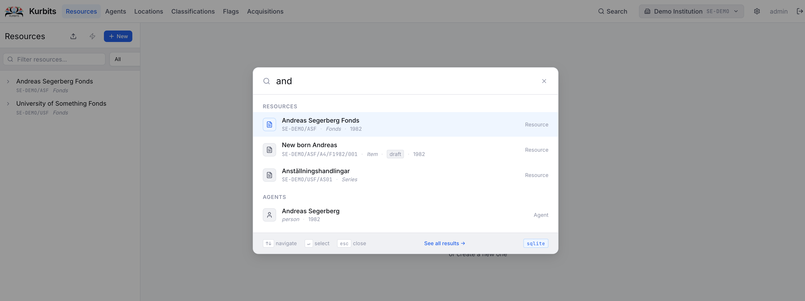
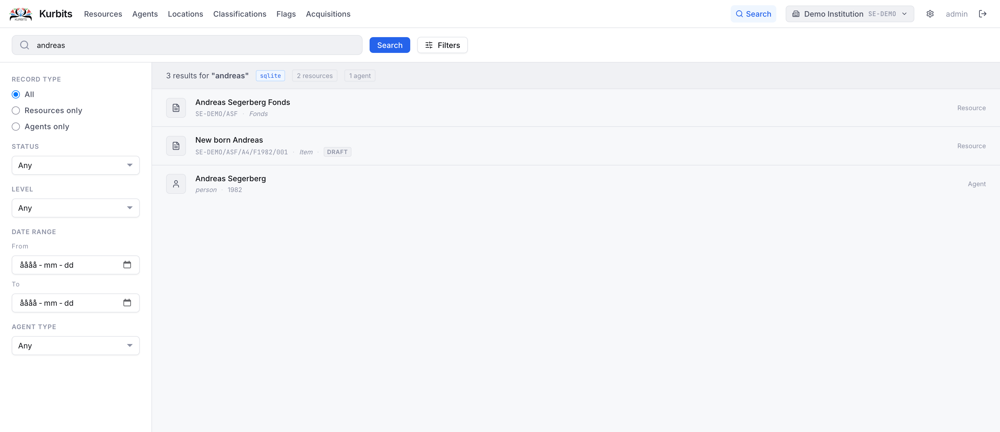

# Search

Kurbits provides full-text search across all records in your institution.

## Accessing search

Click the **Search** icon in the top-right of the navigation bar to open the global search.

Or use quick search with keyboard cmd + shift + k 

This will give you the most relevant hits that you can access directly. Alternatively, click See all results to access the full search page 
where you also have filter options.

## How it works

Type at least two characters to begin searching. Results are grouped by record type:

- **Resources** — archival units (fonds, series, files, items)
- **Agents** — people, organisations, families
- **Classifications** — nodes in your controlled vocabulary schemes

Click any result to navigate directly to that record.

## Search within a section

Each section also has its own search:

- **Resources tree** — the search box above the tree filters resources by title, reference code, or description
- **Agents** — the search box in the left panel filters agents by name
- **Classifications** — the search box filters classification nodes by name or code
- **Acquisitions** — each panel (Agreements, Deliveries, Accessions) has a search box filtering by reference number and title

## Tips

- Search is case-insensitive
- Partial matches work — searching "förvalt" will find "Gemensamma förvaltningen"
- Reference codes can be searched directly — searching "SE-GBG/1/A1" will find that series
