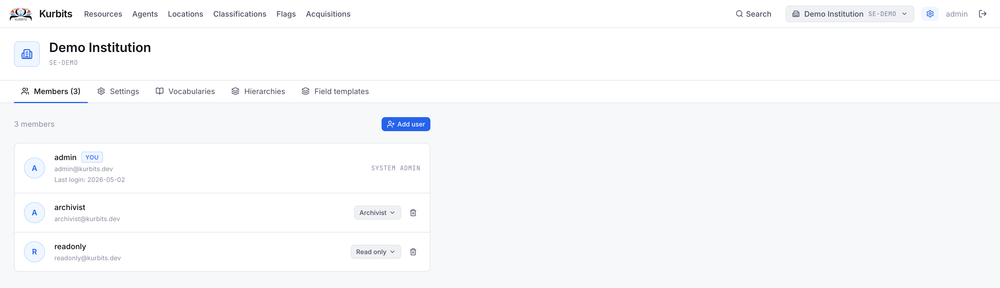
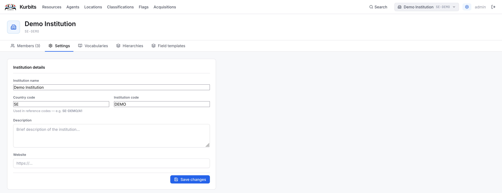
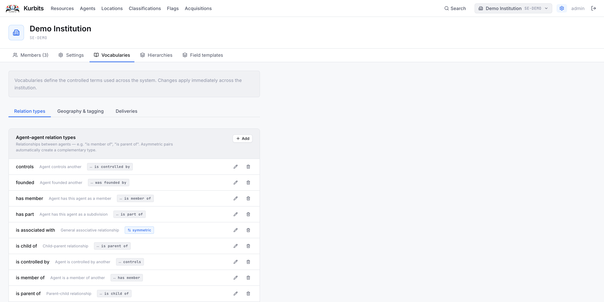
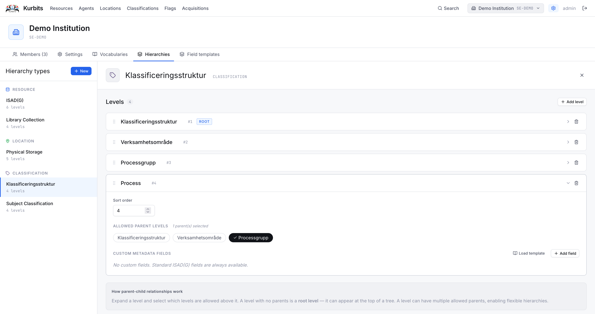
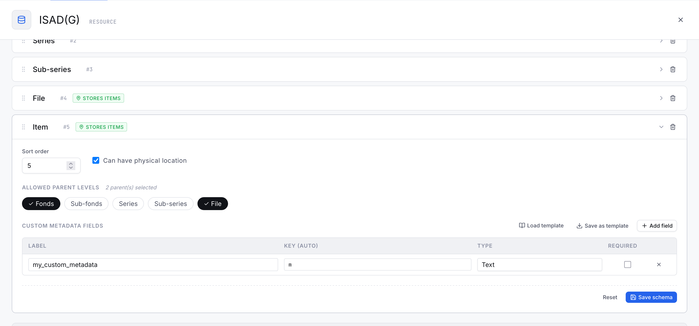

# Administration

Institution administrators have access to an administration panel for managing users, settings, and controlled vocabularies. Access it via your username in the top-right corner and select **Institution settings**.

---

## Members tab

Lists all users with access to this institution and their roles.

### Roles

| Role | Permissions |
|---|---|
| Read only | Can view all records, cannot create or edit |
| Archivist | Can create, edit, and delete all records |
| Institution admin | Full access including user management and settings |

## Settings tab

Institution-level settings including name, reference prefix, country code, and contact information. The **reference prefix** is prepended to all reference codes (e.g. *SE-GBG* gives codes like *SE-GBG/1/A1*).

---

## Vocabularies tab

Manages the controlled vocabularies used across the institution.

### Relations

Defines the relationship types available when linking agents to resources (Creator, Publisher, Subject, Contributor…) and when linking agents to each other.

### Geography & tagging

**Tag categories** group subject tags by type. Each category can be set to apply to resources, agents, or both. Tags within a category are created and managed here.

### Deliveries

**Checklist templates** for the acquisitions module. Each template has a name, an optional delivery method it applies to, and a list of checklist items with labels and descriptions. Mark a template as **Default** to have it applied automatically when creating new deliveries of that method.

---

## Hierarchies tab

Manages the hierarchy types used to structure resources and locations.

A **hierarchy type** defines a set of levels (e.g. Fonds → Series → Sub-series → File → Item) and the valid parent-child relationships between them. Your institution can have multiple hierarchy types — for example one following ISAD(G) for archives and one for library materials.

Editing hierarchy types affects how resources can be arranged and what levels are available when creating new nodes.

---

## Field templates tab

**Metadata templates** define sets of additional fields that appear on resources at a specific level of description — for example a *Photograph* template adding fields for format, technique, emulsion, and dimensions.

Templates can be imported from standard definitions. Your administrator can also create custom templates tailored to your institution's needs.

Click **Import standard templates** to load built-in templates including Dublin Core, Dublin Core Terms, and Photographic records.

---

## Identifier schemes tab

Defines the external and persistent identifier types your resources can carry — ARK, Handle, DOI, ISBN, and so on. See [Resources → Identifiers tab](02-resources.md#the-identifiers-tab) for how they are used.

Each scheme has:

| Setting | Purpose |
|---|---|
| Name | The scheme label (e.g. ARK, DOI) |
| Resolver URL template | Turns a stored value into a clickable link. `{value}` is replaced with the identifier — e.g. `https://n2t.net/{value}` |
| Generator service URL | Optional. An external minting service Kurbits calls to create a new identifier. When set, a **Generate** button appears on records |

For a generator, you can also set request headers (for an authorisation token), a request body template, and where in the response the new identifier is found. Deactivate a scheme rather than deleting it if records already use it.

---

## Records values tab

Manages the dropdown values used when documenting records in a [process description](11-process-descriptions.md) — **disposal actions**, **security classifications**, and **medium / format**. Add or remove values in each list; sensible defaults are provided to start with.

---

## Label designer tab

A drag-and-drop editor for designing box and shelf labels. See [Labels](12-labels.md) for the full guide. In short: you place fields, text, barcodes, QR codes, and logos on a label, save the design as a reusable template, and choose that template when printing labels from a resource.

---

## Transcription tab

Connects Kurbits to a Whisper transcription service for automatic speech-to-text on audio and video files. Enter the service URL, an API key, and a default model. Once configured, audio and video attachments can be transcribed from the resource's Files tab.
