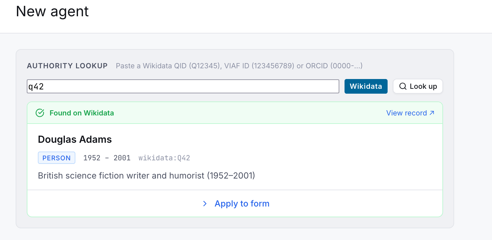
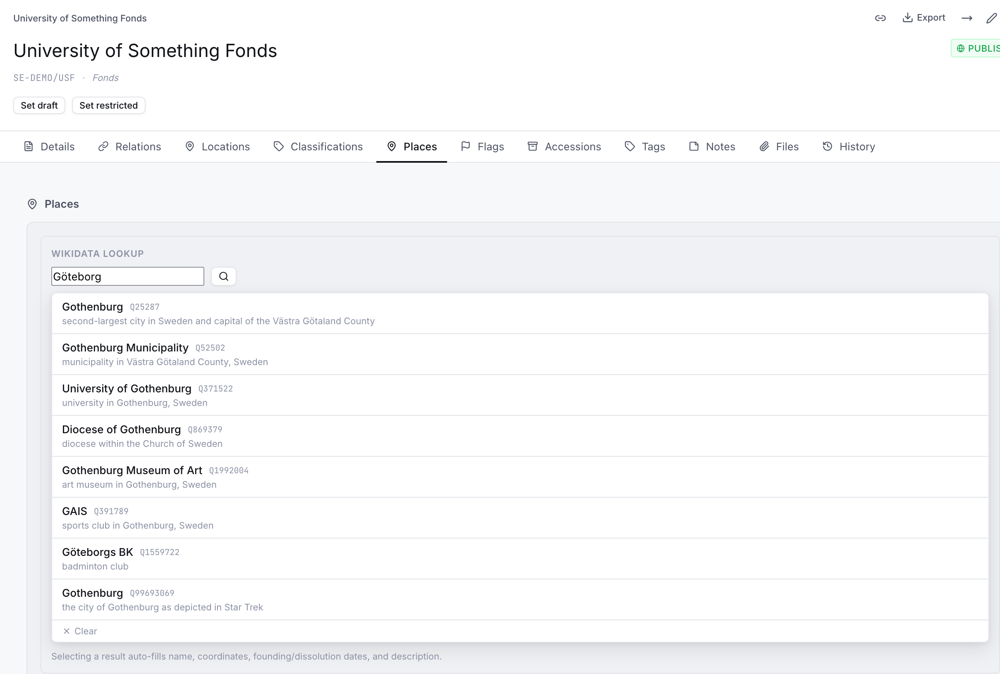
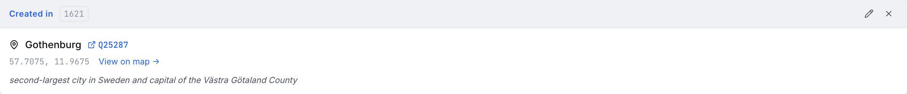
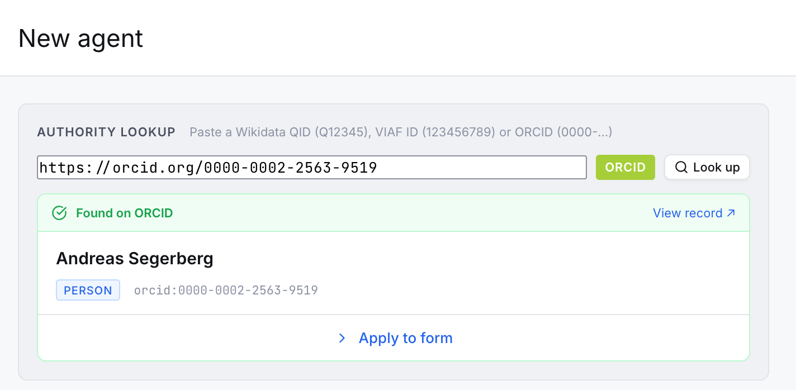
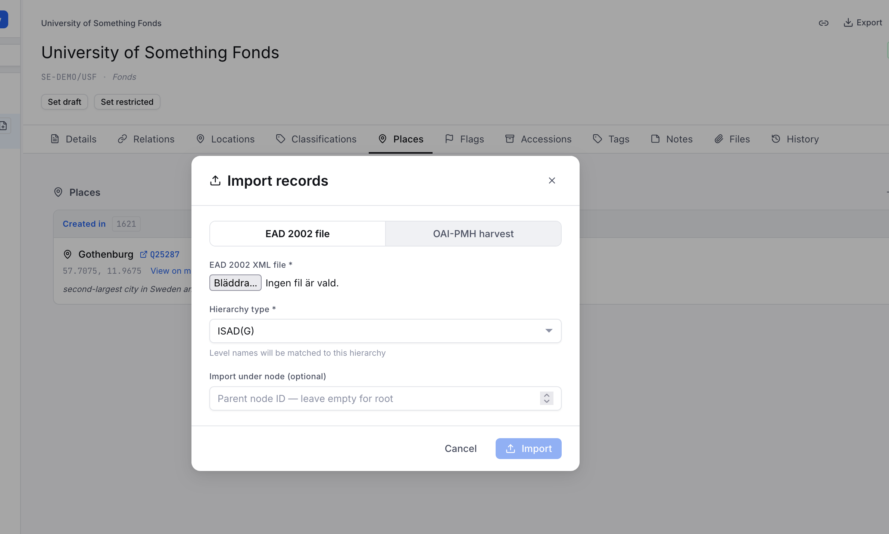
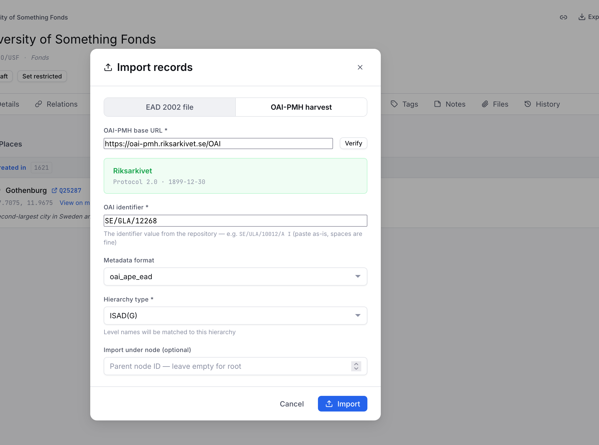
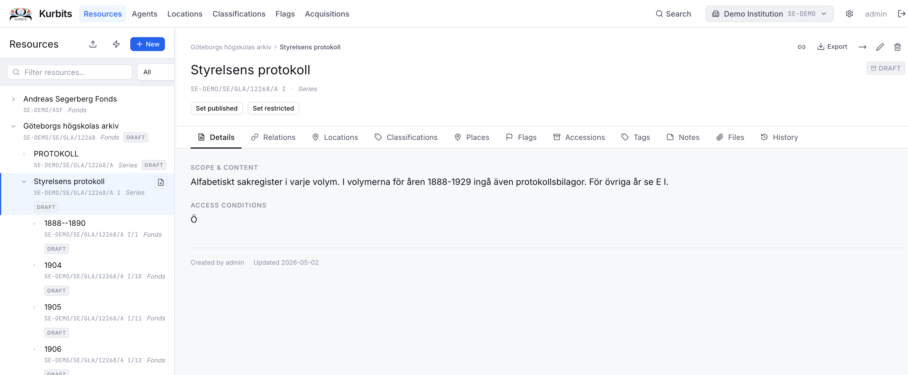
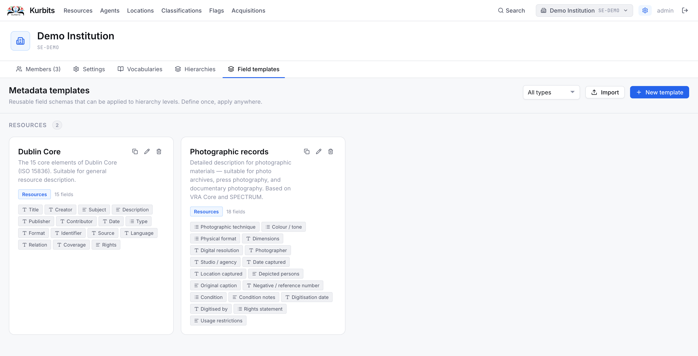

# Authority lookups, import and export

## Authority lookups

Kurbits integrates with several external authority systems to help you identify and enrich agent and place records without manual data entry.

### Wikidata

Wikidata is a free, collaborative knowledge base maintained by the Wikimedia Foundation. Kurbits uses it in two places.

**Agent identifiers** — When editing an agent, you can paste a Wikidata QID (e.g. `Q42`) or a full Wikidata URL into the Wikidata identifier field. Kurbits will look up the entity and fill in:

- Authorised form of name
- Dates of existence
- Description / biographical note
- VIAF identifier (if present on the Wikidata record)

**Places** — On the Places tab of any resource or agent, the Wikidata search widget lets you search for geographic places by name. Selecting a result fills in:

- Place name
- Wikidata identifier
- Coordinates (latitude and longitude, from P625)
- Inception date (P571) → date from
- Dissolved / abolished date (P576) → date to
- Description → note

This is particularly useful for historical places — parishes, municipalities, estates — that have Wikidata entries with well-maintained coordinates and dates.

### VIAF (Virtual International Authority File)

VIAF is a joint project of national libraries worldwide that aggregates authority records across many library systems. When you paste a VIAF identifier or URL into the VIAF field on an agent record, Kurbits retrieves:

- Authorised form of name (preferred heading from VIAF)
- Source authority links (Library of Congress, Biblioteka Narodowa, etc.)

VIAF is especially useful for well-known authors, historical figures, and corporate bodies that have been catalogued by major libraries.

### ORCID

ORCID is a persistent identifier system for researchers and academics. When you paste an ORCID iD (format `0000-0002-1825-0097`) or ORCID URL into the identifier field on a person record, Kurbits validates and normalises the identifier.

ORCID integration is primarily useful for collections with contemporary academic or scientific material where creators have registered ORCIDs.

### How identifier lookup works

On an agent's Details tab, the identifier fields (Wikidata, VIAF, ORCID) each have a **lookup button**. Paste or type the identifier and click the button — Kurbits calls the external API and pre-fills whatever fields it can retrieve. You can always edit the result before saving.

If a field is already filled, the lookup will offer to overwrite it. No changes are saved until you click **Save**.

---

## Import

### EAD import (resources)

Kurbits can import archival descriptions in **EAD 2002** (Encoded Archival Description) format. This is the standard XML format used by most archival management systems for exchange.

To import:

1. Open the **Resources** page
2. Click the **Import** button in the toolbar
3. Choose **EAD file** and upload your `.xml` file
4. Review the preview and confirm

Imported records are created as new nodes. If a record with the same reference code already exists, it will be updated. Notes, agents, dates, levels of description, and scope notes are all mapped from the EAD elements.

### OAI-PMH harvest (resources)

Kurbits can harvest records from any OAI-PMH compliant repository — other archival systems, library catalogues, or aggregators.

To harvest:

1. Open the **Resources** page and click **Import**
2. Choose **OAI-PMH**
3. Enter the base URL of the OAI-PMH endpoint (e.g. `https://oai-pmh.riksarkivet.se/OAI`) for Swedish national Archives
4. Click **Identify** to verify the endpoint and see available metadata formats
5. Choose a format and set any date filters
6. Click **Harvest**
7. 

Harvested records are created or updated based on their OAI identifier. Large harvests may take some time.

### EAC-CPF import (agents)

Agent authority records can be imported from **EAC-CPF** (Encoded Archival Context — Corporate Bodies, Persons, and Families) XML files. This is the standard format for exchanging authority records between archival systems.

To import:

1. Open the **Agents** page
2. Click **Import EAC-CPF**
3. Upload your `.xml` file
4. Choose whether to update existing records (matched by name) or only create new ones
5. Confirm

### Visual Arkiv import (CLI)

See the separate guide: [Visual Arkiv import](visual-arkiv-import.md) (Swedish).

### Metadata template import

Standard metadata templates (Dublin Core, Dublin Core Terms, Photographic records) can be imported from the Administration panel. See [Administration → Field templates](09-administration.md).

---

## Export

### EAD export (resources)

Any resource can be exported as an EAD 2002 XML file. The export includes the selected node and optionally all its descendants.

To export:

1. Select a node in the Resources tree
2. Click the **Export** button in the toolbar
3. Choose **Full export** (node + all descendants) or **Single record** (this node only)
4. The file downloads immediately

The exported EAD file follows the EAD 2002 standard and can be imported into other archival management systems that support EAD.

### Other export formats

Depending on your institution's configuration, additional export formats may be available — for example Dublin Core XML or RDF. These appear in the export dropdown alongside EAD.
