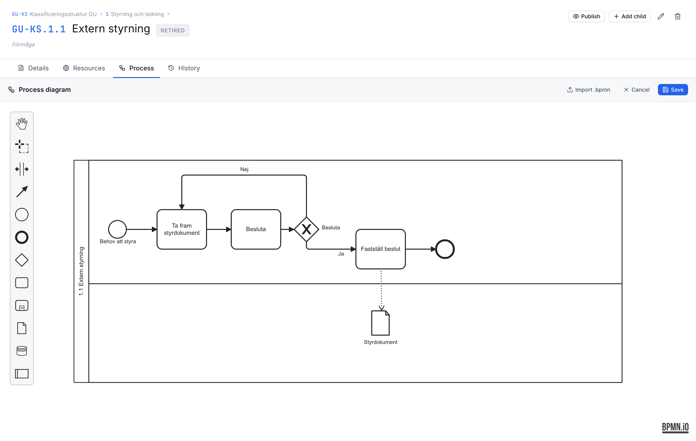
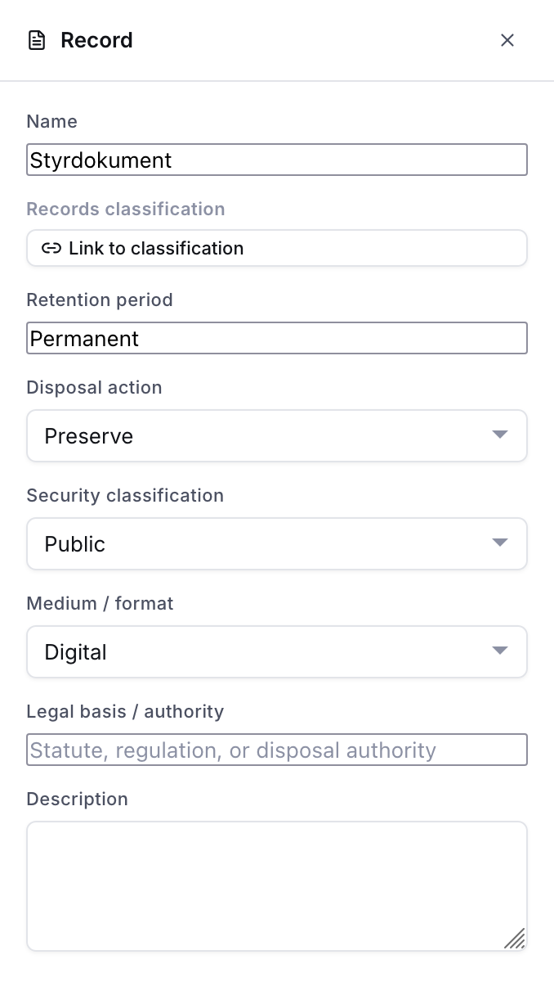
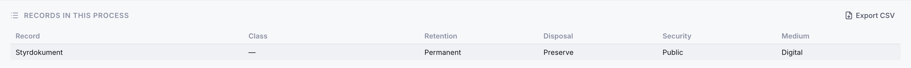

# Process descriptions

Classification nodes can carry a **process diagram** that documents the business process behind a set of records. This supports process-based archival description (*verksamhetsbaserad arkivredovisning*): you describe *what the organisation does*, and connect each step to the records it produces.

Diagrams use **BPMN 2.0**, an open, standard notation for business processes. They are stored as standard BPMN XML, so they can be exported and opened in any BPMN tool.

## Opening the editor

Go to any classification node and open the **Process** tab. If the node has no diagram yet, click **Create diagram** to start a blank one, or **Import .bpmn** to load an existing file. A node that already has a diagram is marked with a dot on the tab.

Published classifications are read-only — create a new version to edit the diagram.

## Drawing a process

The editor gives you a focused palette:

| Element | Meaning |
|---|---|
| Start / end events | Where the process begins and ends |
| Task | An activity or step in the process |
| Gateways | A decision or a split/join in the flow |
| Data object | A **record** produced or used by the process |
| Data store | A persistent store of records |

Drag elements onto the canvas and connect them with arrows. Turn on **Grid (mm)** to show a millimetre grid while positioning.

## Records produced by the process

Draw the records a step produces as **data objects**, and connect them to the relevant task with an arrow:

- An arrow **from a task to a data object** means the task *produces* that record.
- An arrow **from a data object to a task** means the task *uses* that record.

Select a data object to open its panel on the right, where you can:

- **Name** the record (e.g. *Application form*).
- **Link** it to a records classification — a class or series in one of your schemes. Use the scheme selector to search the right scheme.
- Record its **retention period**, **disposal action**, **security classification**, **medium / format**, **legal basis**, and a **description**. The dropdown values come from [Administration → Records values](09-administration.md#records-values-tab).

## Records list and export

Below a saved diagram, the **Records in this process** list shows every record in the diagram at a glance. Use **Export CSV** to download the full records-management detail — including which activity produces and uses each record — as a spreadsheet.

## Produced by

On a records classification node, a **Produced by processes** panel shows which processes produce records in that class, and the retention recorded. This is the reverse view: standing at a record type, you can see every process that creates it.

## Import and export

- **Import .bpmn** loads a standard BPMN 2.0 file into the editor.
- **Export .bpmn** downloads the diagram as standard BPMN XML for preservation or use in other tools.
