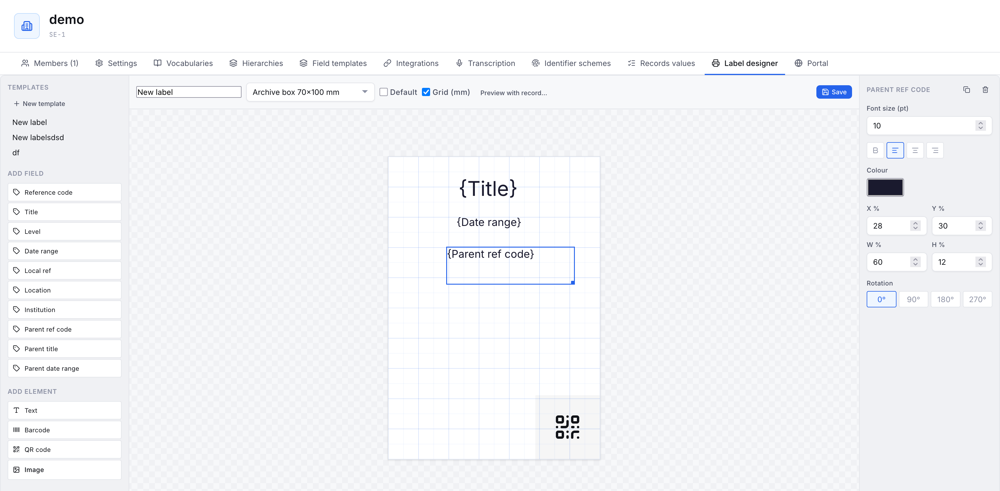

# Labels

Kurbits prints box and shelf labels for your resources, and lets you design your own label layouts with a drag-and-drop editor.

## Printing labels

Select one or more resources and use the **Print labels** button. You can choose:

- A **design template** (if any have been created — see below), or the built-in layout.
- A **label format** — the physical label size and how many fit on an A4 sheet. Formats include standard 90×45 archive labels, Avery sheets, portrait archive-box labels, and tall spine labels.
- The number of **copies**.

A PDF is generated for printing on label sheets.

## Designing your own labels

Open **Administration → Label designer** to create reusable label templates.

The designer has three parts: a palette on the left, the label canvas in the middle, and a properties panel on the right when an element is selected.

### Adding elements

From the palette, add:

- **Fields** — values pulled from each resource at print time: reference code, title, level, date range, local ref, location, institution, and the **parent's** reference code, title, and date range.
- **Text** — fixed text that appears on every label.
- **Barcode** and **QR code** — encoding the reference code (or local ref).
- **Image** — a logo or other picture you upload.

### Positioning

Drag an element to move it; drag the corner handle to resize. The properties panel gives exact position and size in percent, plus:

- Font size, bold, alignment, and colour for text and fields.
- **Rotation** in 90° steps — useful for text running vertically along a spine label.

Turn on the **Grid (mm)** toggle to show an accurate millimetre grid while you work.

### Previewing with real data

By default, fields show generic placeholders like `{Reference code}`. Click **Preview with record…** and pick a resource to fill the label with that record's real values, so you can judge how actual titles and codes fit. This is preview only — it does not change the template.

### Saving

Give the template a name, pick the label format it is designed for, and click **Save**. Mark one as **Default** to have it pre-selected when printing. Saved templates appear in the **Design template** dropdown on the Print labels dialog.

What you see in the designer is what prints — the layout is measured as fractions of the label, so the on-screen preview and the printed PDF match.
